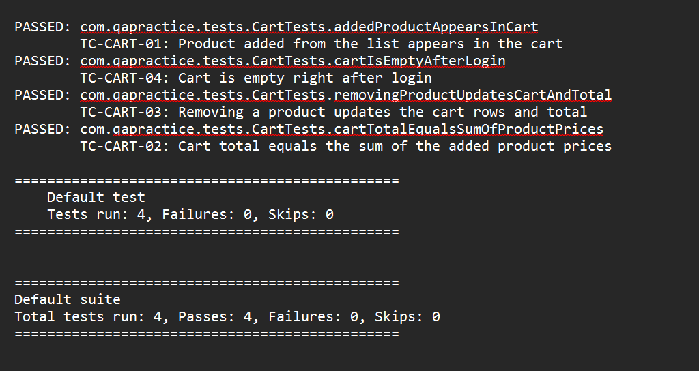

# Modular Selenium Test Automation Framework (Java · Selenium 4 · TestNG · Maven)

**Application under test:** https://qa-practice.razvanvancea.ro/auth_ecommerce.html  
(Login → browse products → add to cart → checkout → order confirmation → logout)

**Course task:** Week 3 – Build a modular and extensible test automation framework.

---

## 1. Objectives and how each one is met

| Requirement from the task | Where it is implemented | Concrete evidence in the repo |
|---|---|---|
| Base test class that starts/stops WebDriver | `framework/base/BaseTest.java` | `@BeforeMethod setUp()` creates a driver, `@AfterMethod(alwaysRun = true) tearDown()` quits it |
| Configuration management (environments, variables) | `framework/config/ConfigManager.java` + `src/main/resources/config/*.properties` | 4-level precedence: `-D` property → `QA_*` env var → `<env>.properties` → `default.properties` |
| Test data handling | `framework/data/*` + `src/test/resources/testdata/*.json` | Typed records (`Credentials`, `ShippingDetails`, …) loaded by `JsonDataReader`; used through TestNG `@DataProvider` |
| Reporting (logs + HTML) | `framework/reporting/*`, `log4j2.xml` | ExtentReports HTML report with steps + failure screenshots; Log4j2 file per run |
| ≥ 3 automated test cases | `src/test/java/com/qapractice/tests/` | **3 classes, 8 test methods, 10 executions** (2 methods are data-driven) – see §8 |
| Easy addition of new tests | §9 of this README | New test = one method in one file; new data row = zero Java changes |
| README with architecture, decisions, execution | this file | §3 architecture, §6 design decisions, §7 execution |

---

## 2. Technology stack

| Concern | Choice | Version | Why this and not the alternative |
|---|---|---|---|
| Language | Java | 17 target/21.0.8 runtime | Records make immutable test-data models one-liners; Java 17 is the project target LTS |
| Browser automation | Selenium WebDriver | 4.27.0 | Requirement of the task; includes Selenium Manager (no manual driver downloads) |
| Test runner | TestNG | 7.10.2 | Groups, `@DataProvider`, listeners, retry analyzer and parallel execution built in (JUnit 5 needs extra extensions for the same) |
| Build | Maven | 3.9+ | Standard dependency management + Surefire suite selection |
| HTML report | ExtentReports (Spark) | 5.1.2 | Readable step list, categories (groups), embedded screenshots |
| Logging | Log4j2 | 2.24.1 | Console + per-run log file, level control in XML |
| Test data | JSON via Jackson | 2.18.2 | Human-editable, no code change to add a data set |

---

## 3. Architecture

```
                         ┌───────────────────────────────┐
                         │  testng.xml / testng-smoke.xml │   suite selection + listeners
                         └───────────────┬───────────────┘
                                         │
        ┌────────────────────────────────▼───────────────────────────────┐
        │  TEST LAYER   src/test/java/.../tests                            │
        │  LoginTests · CartTests · CheckoutTests                          │
        │  (only scenario logic + assertions; no locators, no waits)       │
        └───────┬───────────────────────────────┬────────────────────────┘
                │ extends                       │ reads
   ┌────────────▼───────────┐      ┌────────────▼─────────────┐
   │ BaseTest               │      │ Test data (JSON)         │
   │ setUp / tearDown,      │      │ login.json cart.json     │
   │ loginAsDefaultUser()   │      │ checkout.json            │
   └───────┬────────────────┘      └────────────▲─────────────┘
           │ uses                                │ JsonDataReader → records
   ┌───────▼─────────────────────────────────────┴──────────────────────┐
   │  PAGE LAYER   framework/pages                                       │
   │  BasePage ◄── LoginPage · ShopPage (has CartComponent) · CheckoutPage│
   │  (locators + business actions + explicit waits)                     │
   └───────┬────────────────────────────────────────────────────────────┘
           │ WebDriver from
   ┌───────▼────────────────┐   ┌─────────────────────┐   ┌──────────────────────┐
   │ DriverManager          │◄──│ DriverFactory       │   │ ConfigManager        │
   │ (ThreadLocal driver)   │   │ chrome/firefox/edge │◄──│ -D › QA_ env › <env> │
   └────────────────────────┘   │ local or Grid       │   │ › default.properties │
                                └─────────────────────┘   └──────────────────────┘

   Cross-cutting: TestListener → ExtentManager (HTML) · StepLogger → Log4j2 (log file)
                  RetryTransformer/RetryAnalyzer · ScreenshotUtils
```

**Dependency rule:** tests → pages → driver/config. Nothing in the lower layers knows about the layers above,
so a page class can be reused by any test class and the driver code can be reused for any application.

---

## 4. Project structure (every file and its single responsibility)

```
qa-practice-selenium-framework/
├── pom.xml                          Dependencies, Java 17, Surefire wired to ${suiteXmlFile}
├── testng.xml                       Full regression suite + listener registration
├── testng-smoke.xml                 Smoke suite (groups = "smoke")
├── README.md
├── .gitignore
└── src
    ├── main
    │   ├── java/com/qapractice/framework
    │   │   ├── base
    │   │   │   └── BaseTest.java              Browser lifecycle + reusable steps for all tests
    │   │   ├── config
    │   │   │   └── ConfigManager.java         Layered configuration + typed getters
    │   │   ├── driver
    │   │   │   ├── DriverFactory.java         Builds Chrome/Firefox/Edge (local or Grid), headless options
    │   │   │   └── DriverManager.java         ThreadLocal<WebDriver> → parallel-safe
    │   │   ├── pages
    │   │   │   ├── BasePage.java              Wait-aware click/type/select/read helpers
    │   │   │   ├── LoginPage.java             Login form
    │   │   │   ├── ShopPage.java              Product list, add-to-cart, logout
    │   │   │   ├── CartComponent.java         Cart section (reusable component)
    │   │   │   └── CheckoutPage.java          Shipping form + confirmation
    │   │   ├── data
    │   │   │   ├── JsonDataReader.java        JSON → typed objects
    │   │   │   ├── Credentials.java · ShippingDetails.java          (records)
    │   │   │   └── LoginTestData.java · CartTestData.java · CheckoutTestData.java
    │   │   ├── reporting
    │   │   │   ├── TestListener.java          TestNG events → HTML report, log, screenshot
    │   │   │   ├── ExtentManager.java         Creates the HTML report (one per run)
    │   │   │   ├── ExtentTestManager.java     ThreadLocal<ExtentTest>
    │   │   │   ├── StepLogger.java            One call → log file + report step
    │   │   │   ├── RetryAnalyzer.java         Re-run failures (retry.count)
    │   │   │   └── RetryTransformer.java      Applies the analyzer to every @Test automatically
    │   │   └── utils
    │   │       ├── PriceParser.java           "$1,299.00" → BigDecimal
    │   │       └── ScreenshotUtils.java       Base64 + PNG file
    │   └── resources
    │       ├── config/default.properties · qa.properties · ci.properties
    │       └── log4j2.xml
    └── test
        ├── java/com/qapractice/tests
        │   ├── LoginTests.java
        │   ├── CartTests.java
        │   └── CheckoutTests.java
        └── resources/testdata
            ├── login.json · cart.json · checkout.json
```

Generated at run time (git-ignored): `target/reports/TestReport_<timestamp>.html`,
`target/logs/framework-<timestamp>.log`, `target/screenshots/*.png`.

---

## 5. Module details

### 5.1 Base test class – `BaseTest`
* `@BeforeMethod(alwaysRun = true) setUp` → `DriverManager.initDriver()` – **a fresh browser per test** (no state leaks between tests).
* `@AfterMethod(alwaysRun = true) tearDown` → `DriverManager.quitDriver()` – runs even if the test fails, so no orphan browsers.
* Helpers shared by all tests: `openLoginPage()`, `loginAsDefaultUser()`.
* Failure screenshots are **not** taken here but in `TestListener`, because TestNG calls `onTestFailure` *before* `@AfterMethod`, i.e. while the browser is still open.

### 5.2 Configuration – `ConfigManager`
Precedence for every key (first hit wins):

| # | Source | Example |
|---|---|---|
| 1 | JVM system property | `mvn test -Dbrowser=firefox` |
| 2 | OS environment variable (`QA_` + KEY, dots → `_`) | `QA_APP_USER_PASSWORD=secret` |
| 3 | Environment file selected by `-Denv=` / `QA_ENV` | `config/ci.properties` |
| 4 | `config/default.properties` | `browser=chrome` |

Worked example – running `mvn test -Denv=ci -Dbrowser=firefox`:
`headless=true` and `retry.count=1` come from `ci.properties`, `browser=firefox` comes from the `-D` flag,
and everything else (`app.base.url`, timeouts …) comes from `default.properties`.

Secrets: the demo site publishes its credentials, so they live in `default.properties`; on a real project the
password would be injected as `QA_APP_USER_PASSWORD` from the CI secret store and never committed.

### 5.3 Driver handling – `DriverFactory` / `DriverManager`
* Supports `chrome`, `firefox`, `edge`, headless mode and remote Selenium Grid (`grid.url`).
* Selenium Manager downloads the matching driver binary automatically.
* `ThreadLocal<WebDriver>` gives each thread its own session → parallel execution needs only a change in `testng.xml` (`parallel="methods" thread-count="3"`).
* **No implicit waits** – only explicit waits (`WebDriverWait`), because mixing both produces unpredictable timeouts.

### 5.4 Page objects – `BasePage` and children
* `BasePage` = reusable actions with built-in waits: `click`, `type`, `typeSecret` (masks passwords in logs), `selectByVisibleText`, `waitUntil`, `isDisplayed`. `click` falls back to a JavaScript click if another element intercepts it.
* Each page owns its locators as `private static final By` constants – **one place to fix if the UI changes**.
* `CartComponent` is a *component* (a page section) composed into `ShopPage` (`shop.cart()`), which avoids duplicating cart logic in several pages.
* Every action calls `StepLogger.step(...)` → the HTML report and the log show a readable list of steps with no logging code in the tests.

### 5.5 Test data – `JsonDataReader`
* JSON files in `src/test/resources/testdata/` → typed Java records.
* Test methods receive typed objects via `@DataProvider`; the first parameter is a description that the listener shows in the report (e.g. `userCanPlaceOrder [international - Germany]`).
* Tests are independent of product names: they select products by position and read the expected price from the product list itself.

### 5.6 Reporting and logging
| Artifact | Produced by | Contents |
|---|---|---|
| `target/reports/TestReport_*.html` | ExtentReports via `TestListener` | Pass/fail per test, group categories, step list, stack trace, embedded screenshot on failure, system info (env, browser, OS, Java) |
| `target/logs/framework-*.log` | Log4j2 | Timestamped, thread-tagged log of config loading, driver start/stop, every step, retries |
| `target/screenshots/*.png` | `ScreenshotUtils` | One PNG per failed test |
| `target/surefire-reports/` | TestNG / Surefire | Standard XML/HTML results for CI tools |

### 5.7 Retry
`RetryTransformer` attaches `RetryAnalyzer` to every `@Test`; the number of retries comes from `retry.count`
(0 locally, 1 in the `ci` environment). Test authors write no retry code.

---

## 6. Design decisions

| Decision | Alternatives considered | Rationale |
|---|---|---|
| Page Object Model with a `BasePage` | Locators inside tests | Locator change = 1 edit; tests read like business steps |
| Component class (`CartComponent`) | Cart methods inside `ShopPage` | Cart could appear on several pages; separates concerns |
| `ThreadLocal` driver | `static WebDriver` | Static driver breaks under parallel execution |
| Fresh browser per test | One browser per class | Isolation > speed for a small suite; the cart is client-side state and must not leak |
| Explicit waits only | Implicit wait / `Thread.sleep` | Deterministic, fails fast with a clear timeout message |
| JSON + typed records | Excel / CSV / hard-coded | Readable diffs, no extra library, compile-time safety on fields |
| Layered config with `QA_` prefix | Single properties file | Same code runs locally and in CI; prefix avoids clashing with OS variables such as `BROWSER` |
| Reporting in a listener | Reporting calls inside every test | Zero reporting code in tests; one place to change the report tool |
| Listener + retry registered in `testng.xml` | Annotations on every class | New test classes get reporting/retry automatically |
| Selenium Manager | WebDriverManager library | One dependency less; built into Selenium 4.6+ |
| Assertions on values read from the UI (prices, titles) | Hard-coded expected prices | Tests survive product-catalogue changes |

---

## 7. Setup and execution

### Prerequisites
* JDK 17+ (`java -version`)
* Maven 3.9+ (`mvn -v`)
* Google Chrome (or Firefox / Edge) installed
* Internet access (the application and Maven Central)

### Commands

| Goal | Command |
|---|---|
| Full regression suite (Chrome, visible) | `mvn clean test` |
| Smoke suite only | `mvn clean test -DsuiteXmlFile=testng-smoke.xml` |
| Another browser | `mvn clean test -Dbrowser=firefox` (or `edge`) |
| Headless | `mvn clean test -Dheadless=true` |
| CI profile (headless + 1 retry) | `mvn clean test -Denv=ci` |
| Env variable instead of `-D` (macOS/Linux) | `QA_BROWSER=edge mvn clean test` |
| Env variable (Windows PowerShell) | `$env:QA_BROWSER="edge"; mvn clean test` |
| Selenium Grid | `mvn clean test -Dgrid.url=http://localhost:4444` |
| Parallel | set `parallel="methods" thread-count="3"` on `<suite>` in `testng.xml` |

> Note: `-Dtest=...` makes Surefire ignore `testng.xml`, so the reporting listener would not be registered.
> To run a subset, create a small suite XML (copy `testng-smoke.xml`) and select it with `-DsuiteXmlFile`.

After a run open `target/reports/TestReport_<timestamp>.html` in a browser.

---

## 8. Sample test cases

| ID | Class → method | Groups | What it verifies | Data source |
|---|---|---|---|---|
| TC-LOGIN-01 | `LoginTests.validUserCanLogIn` | smoke, login | Valid user sees Logout button and a non-empty product list | config (`app.user.*`) |
| TC-LOGIN-02 | `LoginTests.invalidCredentialsAreRejected` (×2) | regression, login | Wrong password / unknown email → error message, stays on login form | `login.json` |
| TC-LOGIN-03 | `LoginTests.loggedInUserCanLogOut` | smoke, login | Logout returns to the login form | – |
| TC-CART-01 | `CartTests.addedProductAppearsInCart` | smoke, cart | Added product is the only cart row | – |
| TC-CART-02 | `CartTests.cartTotalEqualsSumOfProductPrices` | regression, cart | Row count and total equal the sum of the product-list prices (soft assertions) | `cart.json` |
| TC-CART-03 | `CartTests.removingProductUpdatesCartAndTotal` | regression, cart | Removing an item updates rows and total | `cart.json` |
| TC-CHK-01 | `CheckoutTests.userCanPlaceOrder` (×2) | smoke, checkout, e2e | Full purchase: login → add → checkout → confirmation | `checkout.json` |
| TC-CHK-02 | `CheckoutTests.orderIsRejectedWhenRequiredFieldsAreMissing` | regression, checkout | No confirmation with empty street/city/country | `checkout.json` |

Total: **8 methods → 10 executions**. Smoke suite = TC-LOGIN-01, TC-LOGIN-03, TC-CART-01, TC-CHK-01 (×2).

### Locator map (single source of truth – edit only these constants if the UI changes)

| Page class | Element | Locator |
|---|---|---|
| `LoginPage` | Email / Password / Submit / message | `#email` / `#password` / `#submitLoginBtn` / `#message` |
| `ShopPage` | Product card / title / price / Add to cart / Logout | `.shop-item` / `.shop-item-title` / `.shop-item-price` / `.shop-item-button` / `#logout` |
| `CartComponent` | Rows / title / price / remove / total / checkout | `.cart-items .cart-row` / `.cart-item-title` / `.cart-price` / `.btn-danger` / `.cart-total-price` / `.btn-purchase` |
| `CheckoutPage` | Phone / Street / City / Country / Submit / message | `#phone` / `name=street` / `name=city` / `#countries_dropdown_menu` / `#submitOrderBtn` / `#message` |

---

## 9. Validation: adding new tests is easy

The task asks to *validate* that new tests can be added easily. These are the concrete scenarios and what has to change:

| Change you want | Files you touch | Framework files touched |
|---|---|---|
| New test in an existing area | 1 test class (add a method) | 0 |
| New test class | 1 new file `extends BaseTest` | 0 – `testng.xml` includes the `com.qapractice.tests` package |
| New data-driven case (e.g. another country) | 1 JSON file (add a row) | 0 – no Java change at all |
| New page | 1 new class `extends BasePage` | 0 |
| New browser | `DriverFactory` (1 case per switch + 1 options method) | 1 |
| New environment (e.g. staging) | 1 new `config/staging.properties`, run with `-Denv=staging` | 0 |

### Worked example – add TC-CART-04 "cart is empty right after login"
Add this method to `CartTests.java` and nothing else:

```java
@Test(groups = {"regression", "cart"}, description = "TC-CART-04: Cart is empty right after login")
public void cartIsEmptyAfterLogin() {
    ShopPage shop = loginAsDefaultUser();
    Assert.assertEquals(shop.cart().itemCount(), 0, "Cart must start empty");
}
```
It automatically gets: a fresh browser, teardown, an entry in the HTML report with step list, a failure
screenshot, log lines, group category, and retry – without any additional code.

### Worked example – add a third checkout data set
Append to `validShipping` in `checkout.json`:
```json
{ "description": "international - Japan", "phone": "8112345678", "street": "1-1 Chiyoda", "city": "Tokyo", "country": "Japan" }
```
`userCanPlaceOrder` now runs three times; no Java is modified.

---

## 10. Risks and mitigations

| Risk | Likelihood / impact | Mitigation built into the framework |
|---|---|---|
| UI locator changes on the practice site | Medium / High | All locators are constants inside page classes (§8 table) – fix in one place |
| Products load asynchronously ("Loading products…") → flaky clicks | High / Medium | `ShopPage.waitUntilLoaded()` and post-click `waitUntil(cart.itemCount()==…)`; no `sleep` |
| Browser/driver version mismatch | Medium / High | Selenium Manager resolves the matching driver automatically |
| Public site slow or briefly unavailable | Medium / Medium | Configurable timeouts, `ci` profile with 1 retry, screenshot + log for diagnosis |
| Tests interfering with each other (shared cart state) | Medium / High | New browser session per test; `ThreadLocal` driver |
| Credentials leaking into logs/repo | Low / High | `typeSecret` masks passwords in logs and report; password overridable by `QA_APP_USER_PASSWORD` |
| Site text (error / confirmation message) differs from expectation | Medium / Low | Expected text lives in JSON (`login.json`, `checkout.json`), not in code |

---

## 11. Planned effort (timeline)

| Phase | Deliverable | Est. hours |
|---|---|---|
| 1. Analysis and design | Architecture, package layout, locator inventory | 3 |
| 2. Project setup | `pom.xml`, folder structure, suites | 2 |
| 3. Configuration + driver | `ConfigManager`, `DriverFactory`, `DriverManager` | 4 |
| 4. Base classes | `BaseTest`, `BasePage` | 3 |
| 5. Page objects | Login, Shop, Cart, Checkout | 4 |
| 6. Test data | JSON files, records, `JsonDataReader` | 2 |
| 7. Reporting/logging | Extent, listener, Log4j2, screenshots, retry | 4 |
| 8. Test cases | 8 methods / 10 executions | 4 |
| 9. Extensibility validation | Add test + data row without touching the framework | 2 |
| 10. Documentation | This README | 3 |
| **Total** | | **31 h** |

---

## 12. Execution evidence 

### Final Regression Execution

**Execution date:** 23 September 2026  
**Operating System:** Windows 11  
**Browser:** Google Chrome 154.0.8037.58  
**Selenium WebDriver:** 4.27.0  
**TestNG:** 7.10.2  
**Java:** 21.0.8  
**Environment:** QA  
**Suite:** QA Practice E-commerce - Regression Suite

**Execution method:** Eclipse TestNG execution using `testng.xml`
The final regression suite was verified through the Eclipse TestNG runner using testng.xml; the README also documents the equivalent Maven execution command for reproducible command-line execution.

**Final TestNG Result:**

===============================================

QA Practice E-commerce - Regression Suite

Total tests run: 10, Passes: 10, Failures: 0, Skips: 0
===============================================

**Execution summary:**

| Test Area | Tests Executed | Passed | Failed | Skipped |
|---|---:|---:|---:|---:|
| Login | 4 | 4 | 0 | 0 |
| Cart | 3 | 3 | 0 | 0 |
| Checkout | 3 | 3 | 0 | 0 |
| **Total** | **10** | **10** | **0** | **0** |

**Validation evidence:**
- All 10 test executions completed successfully.
- A fresh WebDriver session was created and closed for each test.
- Login scenarios validated valid login, invalid credentials, and logout.
- Cart scenarios validated adding products, total calculation, and product removal.
- Checkout scenarios validated required-field rejection and successful orders for India and Germany.
- No test failures or skipped tests were reported.

### HTML Report Evidence

The final ExtentReports execution recorded 10 tests passed, 0 failed, and 0 skipped.


### Execution Log Evidence

The Eclipse TestNG console output confirms the final regression execution completed with 10 tests passed, 0 failed, and 0 skipped.


### Extensibility Validation Evidence

TC-CART-04 was added as a new cart test to validate that the framework supports adding a new test without changes to the existing framework components. The test passed successfully along with the existing cart tests: 4 tests run, 4 passed, 0 failed, and 0 skipped.



The framework was validated successfully with the final regression and extensibility executions described above.

README updated with final execution evidence and extensibility validation.

---

## 13. Known limitations / future work
* No CI pipeline file is included (a GitHub Actions job running `mvn clean test -Denv=ci` is the natural next step).
* Only UI tests; the site's API-testing page could add an API layer (e.g. REST Assured) reusing `ConfigManager` and the reporting layer.
* Quantity changes in the cart are not covered.
